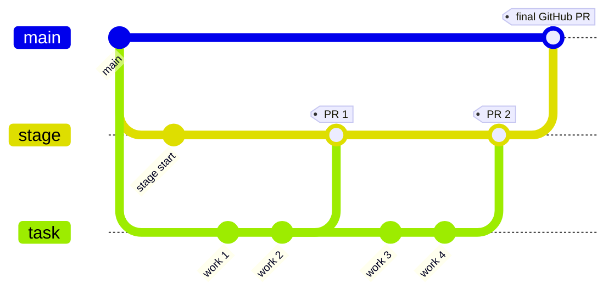

# Joan

Joan is a local Forgejo review gate for AI-assisted code changes.

Breaking change: Joan now supports only the staged branch workflow. The old
temporary review-branch flow and plan-review flow are gone.

## Workflow

1. Start a task branch with `uv run joan task start ...`
2. Joan creates `joan-stage/<task-branch>` on the review remote
3. Open a Forgejo PR from the task branch to the stage branch
4. Resolve review feedback on the task branch
5. Finish the PR into the stage branch with `uv run joan pr finish`
6. When the task is ready for GitHub, run `uv run joan ship`



In real use, the branches are:
- task branch: your normal working branch, for example `feature/redshift-query`
- stage branch: `joan-stage/feature/redshift-query`
- publish branch: a clean upstream branch created by `uv run joan ship`

## Quick Start

```bash
uv run joan init
uv run joan remote add
uv run joan task start feature/redshift-query --from origin/main
uv run joan pr create --title "Add Redshift query task"
uv run joan pr sync
uv run joan pr comments
uv run joan pr finish
uv run joan ship --as sam/redshift-query
```

## Commands

| Command | Description |
|---------|-------------|
| `joan init` | Interactive repo setup |
| `joan remote add` | Create or repair the Forgejo review remote |
| `joan task start <branch> [--from REF]` | Start a new tracked task branch |
| `joan task track --from REF [--branch NAME]` | Put an existing branch under Joan |
| `joan task status [--branch NAME]` | Show the task/stage state as JSON |
| `joan task push` | Push the current task branch to the review remote |
| `joan pr create` | Open a Forgejo PR from the task branch to its stage branch |
| `joan pr sync` | Show approval and unresolved comment state as JSON |
| `joan pr comments` | Show PR comments as JSON |
| `joan pr reviews` | Show review submissions as JSON |
| `joan pr finish` | Merge the approved PR into the stage branch |
| `joan issue create "TITLE" [--body TEXT]` | Create an issue |
| `joan issue link <issue> <blocked-by-issue>` | Link issue dependencies |
| `joan issue close <issue>` | Close an issue |
| `joan issue read [--issue N] [--state ...] [--limit N]` | Read one or many issues as JSON |
| `joan issue blocked-by <issue>` | List blockers for an issue as JSON |
| `joan issue blocks <issue>` | List downstream blocked issues as JSON |
| `joan issue graph <issue> [--depth N]` | Issue dependency graph as JSON |
| `joan ship [--as BRANCH]` | Prepare and push the final upstream publish branch |

## Skills

- `joan-setup`: one-time setup
- `joan-task`: start, track, inspect, and push task branches
- `joan-review`: open or advance a Forgejo review PR
- `joan-resolve-pr`: drive the PR state machine
- `joan-pr-comment`: post or update PR comments
- `joan-create-issue`: create/link/close/read issues and dependency graph JSON
- `phil-review`: trigger Phil’s on-demand AI review

## Notes

- Joan’s review remote still defaults to `joan-review`.
- Joan’s stage branches live on that review remote and use the `joan-stage/` prefix.
- `uv run joan ship` prepares the final upstream branch but does not open the GitHub PR for you.
