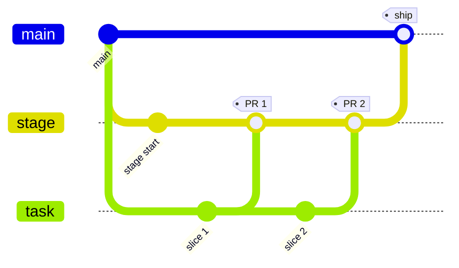

# Review Workflow

Joan reviews a normal task branch into a long-lived stage branch on the Forgejo
review remote.

## Shape of the flow



Real branch names:
- task branch: `feature/cache`
- stage branch: `joan-stage/feature/cache`

## Commands

Start a task:

```bash
uv run joan task start feature/cache --from origin/main
```

Open the first or next PR:

```bash
uv run joan pr create --title "Add cache layer"
```

Inspect state:

```bash
uv run joan pr sync
uv run joan pr comments
uv run joan pr reviews
```

Push another review round after fixes:

```bash
uv run joan task push
```

Finish the approved PR:

```bash
uv run joan pr finish
```

Prepare the final upstream branch:

```bash
uv run joan ship --as sam/cache-layer
```

## Rules

- Do not work on `joan-stage/*` directly.
- Every Forgejo PR should go from the task branch to the matching stage branch.
- `joan pr finish` merges into the stage branch, not into `main`.
- `joan ship` prepares the final upstream branch; it does not open the GitHub PR.
